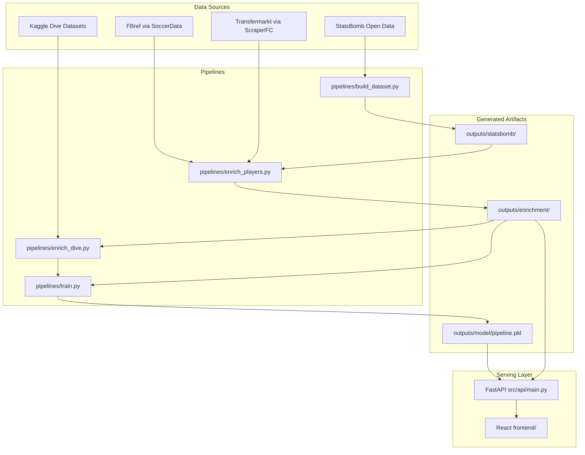

# PenaltyDuel

**A hierarchical, explainable penalty-kick matchup prediction system.**

Given a shooter and a goalkeeper, PenaltyDuel predicts:

- **Goal probability** — calibrated headline score chance with uncertainty awareness
- **Shot placement** — 6-zone goal-mouth heatmap from the keeper's perspective
- **Keeper dive tendency** — left / center / right distribution
- **Plain-language explanation** — SHAP-backed factor cards with honesty rules for sparse players

The system is end-to-end functional: StatsBomb ingestion → enrichment → model training → FastAPI serving → React dashboard.

---

## Table of Contents

- [Why This Project Exists](#why-this-project-exists)
- [How It Works](#how-it-works)
- [Current Dataset & Model Stats](#current-dataset--model-stats)
- [Architecture](#architecture)
- [Tech Stack](#tech-stack)
- [Prerequisites](#prerequisites)
- [Installation](#installation)
- [Data Setup](#data-setup)
- [Pipeline Guide](#pipeline-guide)
- [Running the Application](#running-the-application)
- [API Reference](#api-reference)
- [Frontend Dashboard](#frontend-dashboard)
- [Testing](#testing)
- [Project Structure](#project-structure)
- [Design Principles](#design-principles)
- [Known Limitations](#known-limitations)
- [Roadmap](#roadmap)
- [Further Documentation](#further-documentation)

---

## Why This Project Exists

Most penalty or xG projects predict a single number — goal or no goal — from a flat feature table and stop there. PenaltyDuel treats a penalty as **three coupled decisions**:

1. Where the shooter aims (`P(zone | shooter)`)
2. Where the keeper dives (`P(dive | keeper)`)
3. Whether the shot goes in given both choices (`P(goal | zone, dive, context)`)

That decomposition powers the multi-panel dashboard (heatmap, dive bars, explanation card) and makes the matchup interaction a first-class modeled quantity rather than an afterthought.

The system is also **statistically honest about sparsity**: most players have fewer than 10 career penalties, so every player-level rate uses Beta-Binomial or Dirichlet-multinomial shrinkage toward sensible priors — raw career rates are never used as features.

---

## How It Works

### The composed probability formula

The headline goal probability marginalizes over all zone and dive combinations:

```
P(goal) = Σ_z Σ_d  P(zone=z | shooter) · P(dive=d | keeper) · P(goal | z, d, segment)
```

| Component | What it models | Shrinkage |
|-----------|----------------|-----------|
| **Zone model** | Shooter placement over 6 goal-mouth zones | Dirichlet-multinomial toward `foot × position × league` priors |
| **Dive model** | Keeper movement over `{left, center, right}` | Dirichlet-multinomial; 14 keepers with real labels, rest fall back to population prior |
| **Resolution table** | Goal rate given zone × dive | 18-cell empirical table from Kaggle World Cup shootout data, smoothed |
| **Combo model** | Final log-odds adjustment | Logistic regression on 6 shrunk features (see below) |

### Six goal-mouth zones

Zones are defined from the **keeper's point of view** using StatsBomb end-location coordinates:

| Zone | Definition |
|------|------------|
| `low_left`, `low_center`, `low_right` | Below height threshold (default: `end_z < 2.0`) |
| `high_left`, `high_center`, `high_right` | At or above height threshold |

Horizontal boundaries (keeper POV): left `< 38.67`, center `38.67–41.33`, right `> 41.33` on a 120×80 StatsBomb pitch. Constants live in `conf/settings.py`.

### Combo model features

The serving pipeline uses a **LogisticRegression** combo model (not raw LightGBM) as the primary headline predictor — it consistently beats shrunk-marginal baselines on sparse penalty data:

| Feature | Description |
|---------|-------------|
| `shooter_logodds_offset` | Shooter conversion rate vs global rate, in log-odds space |
| `keeper_concede_logodds_offset` | Keeper concede rate vs global rate |
| `shooter_zone_entropy` | Predictability of shooter's zone distribution |
| `is_shootout` | Whether the kick is from a shootout (`period == 5`) |
| `log1p_shooter_n_pens` | Log sample size for shooter |
| `log1p_keeper_n_faced` | Log sample size for keeper |

### SHAP explanation cards

Every `/predict` response includes a `shap_card` built by `src/explain/cards.py` with enforced honesty rules:

- Never claims "converts X%" when `n_penalties == 0`
- Never claims "saves X%" when `n_faced == 0`
- Confidence tier driven by `min(n_penalties, n_faced)` (high ≥ 20, medium ≥ 5)
- Low-data warning when either player has fewer than 5 recorded kicks

28 honesty tests live in `tests/test_explanation_honesty.py`.

---

## Current Dataset & Model Stats

| Metric | Value |
|--------|-------|
| Penalties | 1,477 |
| Shooters | 772 |
| Keepers | 379 |
| Competitions | 21 |
| Date range | 1974-07-07 → 2025-07-27 |
| Global conversion rate | 73.9% |
| `preferred_foot` coverage | ~50% (618 / 1,146 unique players) |
| Entity resolution matches | 734 high/medium confidence |
| Unresolved players | 408 (see `outputs/enrichment/entity_resolution/unresolved.csv`) |
| Keepers with real dive labels | 14 (Serie A Kaggle set) |
| Dive resolution table cells | 18 (zone × dive) |

---

## Architecture



### Dependency direction

```
conf/settings.py
    ↑
src/ingestion/statsbomb.py  ←── src/cleaning/validate.py
    ↑
pipelines/build_dataset.py
    ↑
pipelines/enrich_players.py ←── src/ingestion/fbref.py
                            ←── src/ingestion/transfermarkt.py
                            ←── src/enrichment/entity_resolution.py
    ↑
pipelines/enrich_dive.py    ←── src/ingestion/kaggle_dive.py
    ↑
pipelines/train.py          ←── src/features/build.py
                            ←── src/models/*
    ↑
src/api/main.py             ←── src/serving/predict.py
                            ←── src/explain/*
```

All commands run from the **project root**. Pipeline scripts insert the root into `sys.path` at startup so `conf/` and `src/` are importable.

---

## Tech Stack

### Backend (Python)

| Layer | Libraries |
|-------|-----------|
| Data | pandas, pyarrow, numpy |
| ML | scikit-learn, LightGBM, SHAP |
| API | FastAPI, uvicorn, pydantic, joblib |
| Enrichment | SoccerData (FBref), ScraperFC (Transfermarkt), rapidfuzz |
| Testing | pytest |

### Frontend

| Layer | Libraries |
|-------|-----------|
| Framework | React 19, React Router 7 |
| Build | Vite 8 |
| Styling | Tailwind CSS 4 (retro 16-bit pixel aesthetic) |
| Lint | Oxlint |

---

## Prerequisites

- **Python** 3.11+ (3.13 tested)
- **Node.js** 18+ and npm (for the frontend)
- **StatsBomb Open Data** cloned into `data/` (see [Data Setup](#data-setup))
- **Kaggle dive datasets** (optional but recommended for dive features):
  - `data/kaggle/real_data.xlsx`
  - `data/kaggle/WorldCupShootouts.csv`
- **~2 GB disk** for raw JSON + generated parquet outputs

> **Windows note:** Set `PYTHONIOENCODING=utf-8` when running pipelines to avoid Unicode errors in console output.

---

## Installation

### 1. Clone the repository

```bash
git clone <your-repo-url>
cd Soccer
```

### 2. Python environment

```bash
python -m venv .venv

# Windows
.venv\Scripts\activate

# macOS / Linux
source .venv/bin/activate

pip install -r requirements.txt

# Additional runtime dependencies (not all listed in requirements.txt)
pip install fastapi uvicorn joblib rapidfuzz soccerdata ScraperFC openpyxl
```

### 3. Frontend dependencies

```bash
cd frontend
npm install
cd ..
```

---

## Data Setup

### StatsBomb Open Data

PenaltyDuel reads StatsBomb's free JSON release from `data/`:

```
data/
├── competitions.json
├── matches/{competition_id}/{season_id}.json
├── events/{match_id}.json      # ~3,961 files scanned for Shot+Penalty events
└── lineups/{match_id}.json     # ~3,820 files used to resolve keeper identity
```

Clone the official repository into `data/`:

```bash
git clone https://github.com/statsbomb/open-data.git data
```

Or symlink an existing copy. Update `conf/settings.py` → `DATA_DIR` if your data lives elsewhere.

### Kaggle dive datasets (Step 8.5)

Place these files before running `pipelines/enrich_dive.py`:

```
data/kaggle/
├── real_data.xlsx              # Rodrigo dataset (~474 kicks, Serie A dive labels)
└── WorldCupShootouts.csv       # Pablo dataset (~279 WC shootout kicks)
```

Without these files, dive enrichment falls back to population-level priors only.

---

## Pipeline Guide

Run pipelines **in order** from the project root. Each step writes artifacts the next step consumes.

### Step 1 — StatsBomb ingestion (~5–15 min)

Scans all event files, resolves keeper identity from lineups, bins shot zones, validates schema.

```bash
PYTHONIOENCODING=utf-8 python pipelines/build_dataset.py
```

**Outputs** → `outputs/statsbomb/`:

| File | Description |
|------|-------------|
| `penalties_statsbomb_clean.parquet` | Core penalty table |
| `penalties_statsbomb_with_freeze_frame.parquet` | Includes keeper freeze-frame coordinates |
| `matches_statsbomb.parquet` | Match metadata index |
| `lineups_statsbomb_penalty_matches.parquet` | Lineup reference for penalty matches |

### Step 2 — Player enrichment (~60 min first run, resumable)

Pulls FBref career PK stats and Transfermarkt attributes (`preferred_foot`, height, DOB). Runs entity resolution to link StatsBomb names to external sources.

```bash
python pipelines/enrich_players.py
```

**Options:**

```bash
python pipelines/enrich_players.py --offline       # cache-only, ~30s
python pipelines/enrich_players.py --skip-fbref    # TM live + FBref from cache
python pipelines/enrich_players.py --skip-tm       # FBref fetch only
python pipelines/enrich_players.py --limit-players 50   # smoke test
```

**Outputs** → `outputs/enrichment/`:

| File | Description |
|------|-------------|
| `penalties_enriched.parquet` | **Primary modeling table** — use this for all downstream work |
| `player_attributes.parquet` | Foot, height, DOB per player |
| `player_career_penalty_stats.parquet` | FBref career PK counts |
| `entity_resolution/name_map.csv` | StatsBomb → FBref/TM identity links |
| `entity_resolution/unresolved.csv` | Players needing human review |

### Step 3 — Dive enrichment (~5 s)

Builds keeper dive distributions and the zone×dive resolution table from Kaggle data.

```bash
PYTHONIOENCODING=utf-8 python pipelines/enrich_dive.py
```

**Outputs:**

| File | Description |
|------|-------------|
| `keeper_dive_distributions.json` | `P(dive | keeper)` for 379 keepers |
| `dive_resolution_table.json` | 18-cell `P(goal | zone, dive)` table |

### Step 4 — Train model (~30 s)

Fits the full outcome pipeline on all enriched data and serializes the artifact.

```bash
PYTHONIOENCODING=utf-8 python pipelines/train.py
```

**Outputs** → `outputs/model/`:

| File | Description |
|------|-------------|
| `pipeline.pkl` | Serialized `OutcomePipeline` (joblib) — **required before starting the API** |
| `metadata.json` | Training stats, feature names, date range |

### Full rebuild (one-liner reference)

```bash
PYTHONIOENCODING=utf-8 python pipelines/build_dataset.py && \
python pipelines/enrich_players.py && \
PYTHONIOENCODING=utf-8 python pipelines/enrich_dive.py && \
PYTHONIOENCODING=utf-8 python pipelines/train.py
```

---

## Running the Application

You need a trained model artifact (`outputs/model/pipeline.pkl`) and enriched data before starting the API.

### Start the API (port 8000)

```bash
uvicorn src.api.main:app --reload --port 8000
```

On startup the server:

1. Loads `pipeline.pkl`
2. Reads `penalties_enriched.parquet` and builds a player index (772 shooters, 379 keepers)
3. Initializes a SHAP `LinearExplainer` for explanation cards

Interactive API docs: [http://localhost:8000/docs](http://localhost:8000/docs)

### Start the frontend (port 5173)

```bash
cd frontend
npm run dev
```

Open [http://localhost:5173](http://localhost:5173). Vite proxies `/api/*` → `http://localhost:8000` (see `frontend/vite.config.js`).

### Quick smoke test

```bash
curl http://localhost:8000/health

curl -X POST http://localhost:8000/predict \
  -H "Content-Type: application/json" \
  -d '{"shooter_name": "Lionel Messi", "keeper_name": "Gianluigi Buffon"}'
```

---

## API Reference

Base URL: `http://localhost:8000` (dev) or your deployed backend URL.

### `GET /health`

Liveness check and dataset summary.

**Response example:**

```json
{
  "status": "ok",
  "n_shooters": 772,
  "n_keepers": 379,
  "global_goal_rate": 0.7393,
  "n_penalties_trained": 1477
}
```

### `GET /players/shooters`

Search or list shooters.

| Parameter | Type | Description |
|-----------|------|-------------|
| `q` | string (optional) | Fuzzy name search. Empty returns top 50 by penalty count. |

**Response item:**

```json
{
  "id": "12345",
  "name": "Lionel Andrés Messi Cuccittini",
  "n_penalties": 82,
  "conv_rate_shrunk": 0.8123
}
```

### `GET /players/keepers`

Search or list keepers. Same interface as shooters; returns `n_faced` and `save_rate_shrunk`.

### `POST /predict`

Predict a shooter vs keeper matchup.

**Request body:**

```json
{
  "shooter_name": "Lionel Messi",
  "keeper_name": "Gianluigi Buffon"
}
```

Names are resolved via normalized exact match first, then fuzzy search (`rapidfuzz` WRatio).

**Response fields:**

| Field | Description |
|-------|-------------|
| `goal_probability` | Final calibrated headline probability |
| `composed_probability` | Zone×dive marginalization before combo adjustment |
| `explanation` | Short text summary |
| `shooter` / `keeper` | Profile dicts (id, name, rates, foot, height) |
| `zone_distribution` | 6 zones with `prob` and `goal_prob` per zone |
| `dive_distribution` | Left / center / right probabilities |
| `shap_card` | Headline, confidence, low-data warning, factor breakdown |

**Error codes:**

| Code | Meaning |
|------|---------|
| `404` | Shooter or keeper not found |
| `503` | Model or player index not loaded yet |

---

## Frontend Dashboard

Retro 16-bit pixel UI built with React + Tailwind.

| Route | Page | Description |
|-------|------|-------------|
| `/` | **Matchup Builder** | Search shooter and keeper, navigate to prediction |
| `/predict?shooter=X&keeper=Y` | **Prediction Results** | Goal probability, zone heatmap, dive bars, SHAP terminal |
| `/players` | **Player Explorer** | Browse shooter and keeper profiles |

### Environment configuration

For production deployment, set the API base URL:

```bash
# frontend/.env.production
VITE_API_BASE=https://your-api.example.com
```

Update `frontend/src/api.js` to read `import.meta.env.VITE_API_BASE || '/api'` when deploying separately from the backend.

---

## Testing

Run the full test suite from the project root:

```bash
pytest tests/ -v
```

| Test file | What it covers |
|-----------|----------------|
| `test_no_leakage.py` | Temporal feature integrity — **must pass before modeling** |
| `test_explanation_honesty.py` | SHAP card honesty rules (28 tests) |
| `test_shrinkage.py` | Beta-Binomial and Dirichlet shrinkage utilities |
| `test_combo.py` | Log-odds combo model features |
| `test_baselines.py` | Shrunk-marginal baseline predictions |
| `test_calibration.py` | Probability calibration |
| `test_outcome_lgbm.py` | LightGBM overfitting cross-check |
| `test_resolution.py` | Zone×dive resolution table |
| `test_splitters.py` | Temporal train/test splits |
| `test_metrics.py` | Log loss, Brier score, ECE |
| `test_generalization.py` | Cross-competition generalization |
| `test_ablation.py` | Feature ablation framework |
| `test_providers.py` | FeatureProvider interface (video upgrade seam) |

### Evaluation rules

- **Primary metrics:** log loss + Brier score (never accuracy — 73.9% base rate makes accuracy misleading)
- **Primary split:** temporal (train before cutoff, test after) — never random
- **Bar to beat:** shrunk-marginal baselines (shooter-only, keeper-only) — not the global rate
- **Always report calibration:** reliability diagram + Expected Calibration Error (ECE)

---

## Project Structure

```
Soccer/
├── conf/
│   └── settings.py              # Paths, pitch constants, outcome mappings
├── context_files/               # Architecture blueprints and implementation plans
├── data/                        # StatsBomb Open Data (read-only, not committed)
│   └── kaggle/                  # Optional dive label datasets
├── frontend/                    # React + Vite dashboard
│   └── src/
│       ├── pages/               # Home, Prediction, Players
│       ├── components/          # TopNav, PlayerSearch, ScanlineOverlay
│       └── api.js               # Fetch wrappers for /api proxy
├── notebooks/
│   └── 01_eda.ipynb             # Exploratory data analysis
├── outputs/                     # Generated artifacts (not committed)
│   ├── statsbomb/
│   ├── enrichment/
│   └── model/
├── pipelines/
│   ├── build_dataset.py         # StatsBomb ingestion
│   ├── enrich_players.py        # FBref + Transfermarkt enrichment
│   ├── enrich_dive.py           # Kaggle dive labels
│   └── train.py                 # Model training + serialization
├── src/
│   ├── api/                     # FastAPI application
│   ├── cleaning/                # Validation assertions
│   ├── enrichment/              # Entity resolution (StatsBomb ↔ FBref/TM)
│   ├── evaluation/              # Metrics, splits, ablation
│   ├── explain/                 # SHAP wrapper + explanation cards
│   ├── features/                # As-of features, shrinkage, build pipeline
│   ├── ingestion/               # StatsBomb, FBref, TM, Kaggle loaders
│   ├── models/                  # Baselines, combo, LGBM, dive prior, resolution
│   ├── serving/                 # Player index + matchup prediction
│   └── viz/                     # Goal-mouth visualization helpers
├── tests/                       # pytest suite
├── CLAUDE.md                    # Agent/developer quick reference
├── NEXT_STEPS.md                # Prioritized improvement backlog
└── requirements.txt
```

---

## Design Principles

### Three models, not one

Never collapse placement, dive, and outcome into a single binary classifier. The dashboard needs multi-output predictions; the math needs explicit interaction via the resolution table.

### Sparsity is the central problem

Most players have fewer than 10 career penalties. Every player-level rate uses shrinkage toward a fallback chain:

```
player → (foot × position × league) → (foot × position) → (foot) → global
```

Raw career rates must **never** be used as model features.

### Temporal leakage is the cardinal sin

All history features are computed **as-of the kick date** using expanding windows only. `tests/test_no_leakage.py` guards this invariant.

### Never drop rows globally for partial missingness

Missing `keeper_dive` in StatsBomb data does not drop the row from outcome model training. Each sub-model handles its own missing fields.

### Critical schema facts

| Fact | Detail |
|------|--------|
| `keeper_id` | Not on the shot event — derived from opposing lineup by matching goalkeeper position to kick period (`src/ingestion/statsbomb.py:_resolve_keeper`) |
| `keeper_dive_direction` | Always NaN in StatsBomb-only data; dive labels come from Kaggle enrichment |
| `gk_freeze_location_x/y` | Keeper position **at kick instant** (pre-dive stance), not completed dive direction |
| `is_shootout` | `period == 5` (StatsBomb convention) |

### Video upgrade seam

When adding video features later, implement a `FeatureProvider` interface in `src/features/providers.py` so tabular and video features are separate providers concatenated at assembly time. Missing video features become `null + video_is_missing=True`.

---

## Known Limitations

| Issue | Impact | Status |
|-------|--------|--------|
| **Enrichment coverage ~50%** | 408 players lack `preferred_foot` / height — entity resolution fails on legal vs short names (e.g. "Lionel Andrés Messi Cuccittini" vs "Lionel Messi") | Fix planned: `token_set_ratio` + short-name fallback in `entity_resolution.py` |
| **Thin dive data** | Only 14 Serie A keepers have real dive labels; others use league/global Dirichlet prior | Expand via more Kaggle datasets or manual video labeling |
| **Frontend bugs** | Matchup cards show "? PENALTIES RECORDED"; `/predict` without params crashes; 3-panel grid breaks on mobile | See `NEXT_STEPS.md` Priority 2 |
| **Local only** | No cloud deployment configured | Deploy API to Render/Railway, frontend to Vercel |
| **Incomplete requirements.txt** | Missing `fastapi`, `uvicorn`, `joblib`, `rapidfuzz`, `soccerdata`, `ScraperFC` | Install manually (see [Installation](#installation)) |

---

## Roadmap

Prioritized improvements (full detail in `NEXT_STEPS.md`):

| Priority | Area | Expected impact |
|----------|------|-----------------|
| 1 | Fix entity resolution (`token_set_ratio`) | Foot/height coverage 50% → 70%+ |
| 2 | Frontend bug fixes | Stable UX on all pages and screen sizes |
| 3 | Expand dive data | 14 → 100+ keepers with real dive labels |
| 4 | Deploy to cloud | Publicly shareable demo URL |
| 5 | Model features | Height differential, foot×zone interaction, era priors |
| 6 | More StatsBomb competitions | 1,477 → 2,000+ penalties |

---

## Further Documentation

Deep-dive references in `context_files/`:

| Document | Contents |
|----------|----------|
| `penalty_shootout_predictor_blueprint.md` | Full architecture, schema, feature catalog, modeling strategy |
| `penalty_predictor_implementation_plan.md` | Step-by-step build order, definition-of-done, common mistakes |
| `penalty_statsbomb_colab_workflow.md` | StatsBomb schema details and 9-step ingestion workflow |
| `penalty_predictor_design_doc.md` | Product and design specifications |

Agent quick reference: `CLAUDE.md`

---

## Data Attribution

- **StatsBomb Open Data** — event, match, and lineup JSON ([statsbomb.com](https://statsbomb.com/))
- **FBref** — career penalty statistics via [SoccerData](https://github.com/probberechts/soccerdata)
- **Transfermarkt** — player attributes via [ScraperFC](https://github.com/oseymour/ScraperFC)
- **Kaggle dive datasets** — hand-coded keeper dive directions for Serie A and World Cup shootouts

---

## Contributing

1. Run `pytest tests/ -v` before opening a PR — especially `test_no_leakage.py` and `test_explanation_honesty.py`
2. Follow temporal split rules for any new modeling work
3. Never use raw player rates as features; always shrink toward priors
4. Match existing code conventions in `src/` (dataclasses, explicit paths, lazy imports for heavy deps)

---

*PenaltyDuel v0.1 — hierarchical penalty prediction with explainable matchup modeling.*
