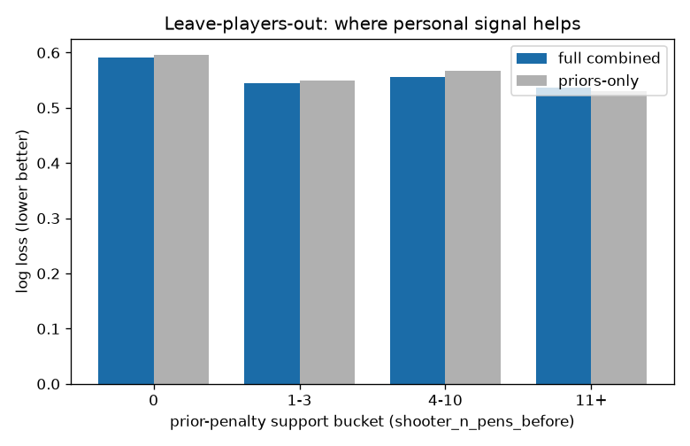

# Generalization - Step 8

Grouped out-of-fold CV on groups never seen in training. Temporal is the headline split (see results_table.md); these grouped splits back the generalization claim and are reported separately, not averaged in.

## Leave-players-out (n=1477)

| model | log loss | Brier | ECE |
| --- | --- | --- | --- |
| full combined | 0.5694 | 0.1910 | 0.0037 |
| priors-only | 0.5742 | 0.1929 | 0.0004 |

Metric by prior-penalty support bucket (log loss):

| n_pens bucket | n | full | priors-only |
| --- | --- | --- | --- |
| 0 | 772 | 0.5917 | 0.5956 |
| 1-3 | 471 | 0.5439 | 0.5500 |
| 4-10 | 138 | 0.5551 | 0.5678 |
| 11+ | 96 | 0.5362 | 0.5303 |

## Leave-competition-out (n=1477)

| model | log loss | Brier | ECE |
| --- | --- | --- | --- |
| full combined | 0.5697 | 0.1912 | 0.0120 |
| priors-only | 0.5757 | 0.1935 | 0.0037 |

Metric by prior-penalty support bucket (log loss):

| n_pens bucket | n | full | priors-only |
| --- | --- | --- | --- |
| 0 | 772 | 0.5941 | 0.5967 |
| 1-3 | 471 | 0.5418 | 0.5524 |
| 4-10 | 138 | 0.5580 | 0.5683 |
| 11+ | 96 | 0.5272 | 0.5325 |

