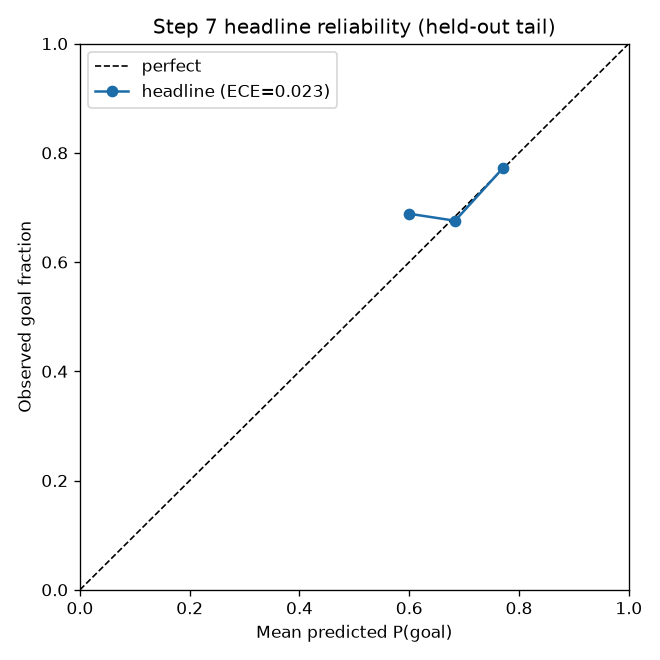

# Outcome Model Report - Step 7

Generated by `python reports/train_outcome_model.py`.

## Headline Model

- Model version: `v0.2-step7`.
- Architecture: calibrated combined log-odds outcome model (shooter + keeper shrunk rates combined in log-odds space). The composed placement/resolution path and meta-blender were evaluated but did not improve on the combined model (see diagnostics below).
- Calibration method selected on held-out slice: `none`.
- Evaluation: rolling expanding-window temporal CV (5 folds over the most recent 50% of kicks).

## Baseline Gate (rolling temporal CV)

- **Headline beats keeper-shrunk floor on log loss AND Brier: `True`.**
- Mean log loss improvement vs floor: `+0.0024` (0.5844 vs 0.5868).
- Mean Brier improvement vs floor: `+0.0007` (0.1982 vs 0.1989).
- Brier Skill Score vs floor: `+0.0033`.
- Folds won (log loss) by headline: `4/5`.

The improvement is deliberately modest: penalty outcomes are ~74% base rate and severely sparse, so a small, consistent, well-calibrated gain over the shrunk-marginal floor is the honest target (not an implausibly high AUC).

## Cross-validated metrics

| model | log loss (mean ± std) | Brier (mean ± std) |
| --- | --- | --- |
| global rate | 0.5943 ± 0.0421 | 0.2020 ± 0.0191 |
| keeper-shrunk baseline | 0.5868 ± 0.0307 | 0.1989 ± 0.0142 |
| composed placement/resolution | 0.5932 ± 0.0410 | 0.2016 ± 0.0187 |
| combined log-odds | 0.5844 ± 0.0383 | 0.1982 ± 0.0173 |
| meta-blend (diagnostic) | 0.5942 ± 0.0386 | 0.2023 ± 0.0173 |
| combined log-odds (calibrated) [headline] | 0.5844 ± 0.0383 | 0.1982 ± 0.0173 |

## Calibration

- Headline ECE on held-out tail: `0.0226` (keeper floor ECE: `0.0138`, 297 rows).
- Diagnostic meta-blend log-odds weights: `{'combo': 1.48, 'composed': 0.0615, 'keeper': 0.5068}` (the blend down-weights the composed placement signal, which is why it does not beat the combined model alone).

## Composed placement/resolution path

- `P(goal) = Σ_z P(zone=z | shooter) · P(goal | zone=z)`.
- The resolution table `P(goal | zone)` is fit on training rows only (Laplace-smoothed toward the train global rate); the shooter zone distribution is the as-of Step 5 feature, so the path is leak-safe.
- It is a component of the meta-blend, contributing placement signal orthogonal to the keeper marginal.
- Dive composition (`P(goal | zone, dive)`) stays deferred: `keeper_dive_direction` has 0% coverage in the StatsBomb-only dataset.

## LightGBM cross-check (single temporal split)

| model | log_loss | brier | brier_skill_score | roc_auc | ece |
| --- | --- | --- | --- | --- | --- |
| keeper_shrunk_baseline | 0.5985 | 0.2041 | 0.0000 | 0.5778 | 0.0152 |
| direct | 0.6059 | 0.2079 | -0.0187 | 0.5696 | 0.0610 |
| direct_calibrated | 0.6080 | 0.2084 | -0.0211 | 0.5696 | 0.0382 |

On data this small the gradient-boosted tree does not beat the smooth log-odds combination, which confirms there is little extra nonlinearity to exploit - exactly why the logistic combination is the headline.
